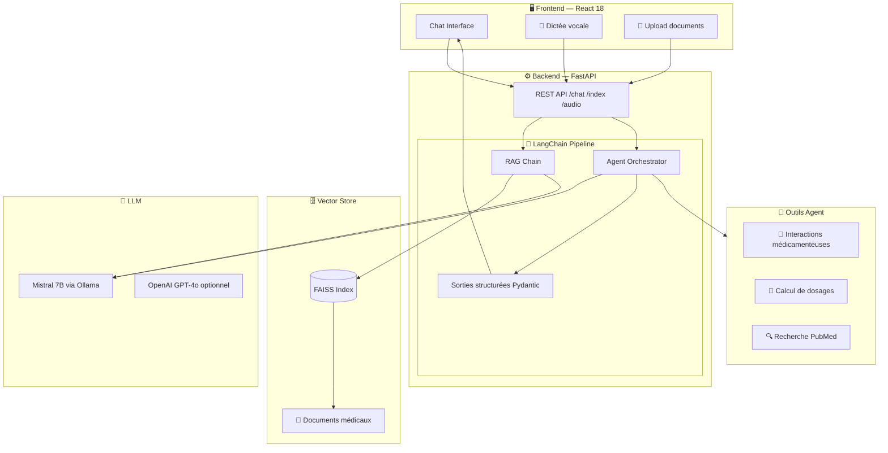
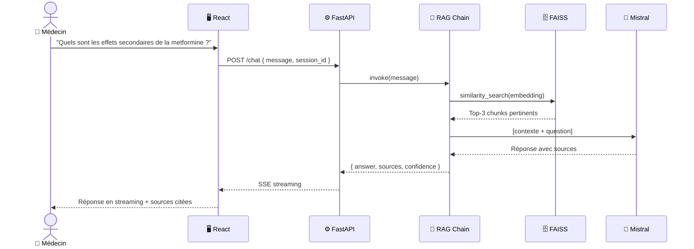

<div align="center">


<br/><br/>

# 🩺 MedAssist AI
### Chatbot médical intelligent — RAG · Agents · Multimodalité

> Un assistant IA de nouvelle génération pour les professionnels de santé.  
> Basé sur **LangChain**, **Mistral** et une architecture **RAG** vectorielle,  
> MedAssist répond aux questions médicales en citant ses sources, comprend les ordonnances  
> et peut interagir avec votre système de gestion hospitalière.

<br/>

[](https://github.com/YOUR_USERNAME/medassist-ai)
[](./docs/architecture.md)

</div>

---

## 📋 Table des matières

- [✨ Fonctionnalités](#-fonctionnalités)
- [🏗️ Architecture](#️-architecture)
- [🛠️ Stack technique](#️-stack-technique)
- [🚀 Installation rapide](#-installation-rapide)
- [📖 Guide d'utilisation](#-guide-dutilisation)
- [🔌 API Reference](#-api-reference)
- [🧪 Notebooks & Expériences](#-notebooks--expériences)
- [📂 Structure du projet](#-structure-du-projet)
- [🤝 Contribuer](#-contribuer)

---

## ✨ Fonctionnalités

| Fonctionnalité | Description | Status |
|---|---|---|
| 💬 **Chat médical RAG** | Répond en se basant sur vos documents médicaux indexés | ✅ |
| 🔍 **Recherche vectorielle** | FAISS + embeddings Mistral pour une recherche sémantique précise | ✅ |
| 🤖 **Agents autonomes** | Appel d'outils externes (APIs, calculs de dosages, interactions médicamenteuses) | ✅ |
| 🖼️ **Multimodalité** | Analyse d'ordonnances (images), transcription vocale pour dictée médicale | ✅ |
| 📊 **Sorties structurées** | Réponses typées via Pydantic — fiabilité garantie | ✅ |
| 🔒 **Confidentialité** | Déployable 100% on-premise avec Ollama (aucune donnée en dehors) | ✅ |
| 🌐 **Interface React** | UI moderne style ChatGPT avec historique, sources citées et mode vocal | ✅ |

---

## 🏗️ Architecture



### Flux d'une requête RAG



---

## 🛠️ Stack technique

<div align="center">

| Couche | Technologie | Rôle |
|---|---|---|
| **LLM** | Mistral 7B (Ollama) / GPT-4o | Génération de réponses |
| **Orchestration** | LangChain 0.2 | RAG, Agents, Chains |
| **Embeddings** | `mistral-embed` / `text-embedding-3-small` | Vectorisation des documents |
| **Vector Store** | FAISS | Recherche sémantique |
| **Backend** | FastAPI + Python 3.11 | API REST & WebSocket |
| **Frontend** | React 18 + TailwindCSS | Interface utilisateur |
| **Validation** | Pydantic v2 | Sorties structurées fiables |
| **Audio** | OpenAI Whisper | Transcription vocale |
| **Vision** | GPT-4o Vision | Analyse d'ordonnances |
| **Infra** | Docker + Docker Compose | Déploiement conteneurisé |

</div>

---

## 🚀 Installation rapide

### Prérequis

- Python 3.11+
- Node.js 18+
- Docker & Docker Compose
- [Ollama](https://ollama.ai) installé localement

### 1. Cloner le repo

```bash
git clone https://github.com/YOUR_USERNAME/medassist-ai.git
cd medassist-ai
```

### 2. Configurer l'environnement

```bash
cp .env.example .env
# Éditer .env avec vos clés API
```

### 3. Lancer avec Docker (recommandé)

```bash
docker-compose up --build
```

> 🎉 L'application est disponible sur `http://localhost:3000`

### 4. Installation manuelle (développement)

```bash
# Backend
cd backend
python -m venv .venv
source .venv/bin/activate  # Windows: .venv\Scripts\activate
pip install -r requirements.txt
uvicorn main:app --reload --port 8000

# Frontend (autre terminal)
cd frontend
npm install
npm run dev
```

### 5. Indexer vos documents médicaux

```bash
# Déposer vos PDF/TXT dans data/documents/
python backend/vectorstore/indexer.py --source data/documents/
```

---

## 📖 Guide d'utilisation

### Mode Chat RAG

Posez des questions médicales, le bot répond en citant les passages pertinents de vos documents :

```
Vous : Quelles sont les contre-indications de l'ibuprofène ?

MedAssist : D'après le Vidal 2024 (p.347), l'ibuprofène est contre-indiqué en cas de :
  • Ulcère gastro-duodénal actif
  • Insuffisance rénale sévère (DFG < 30 ml/min)
  • Grossesse à partir du 6e mois
  [Source: vidal_2024.pdf, chunk 12]
```

### Mode Agent

Pour des tâches complexes multi-étapes (calculs, recherches externes) :

```
Vous : Calcule la dose de paracétamol pour un enfant de 25 kg,
       et vérifie les interactions avec l'amoxicilline.

MedAssist : [Appel outil: calcul_dosage] → 500mg toutes les 6h
            [Appel outil: interactions_medicamenteuses] → Aucune interaction connue ✅
```

### Mode Vocal

Cliquez sur 🎤 pour dicter votre question — la transcription Whisper est automatique.

---

## 🔌 API Reference

| Endpoint | Méthode | Description |
|---|---|---|
| `/chat` | `POST` | Envoie un message, retourne une réponse RAG en streaming |
| `/chat/agent` | `POST` | Mode agent avec outils |
| `/index` | `POST` | Indexe un document dans FAISS |
| `/audio/transcribe` | `POST` | Transcription audio → texte |
| `/health` | `GET` | Statut de l'application |

**Exemple d'appel :**

```bash
curl -X POST http://localhost:8000/chat \
  -H "Content-Type: application/json" \
  -d '{"message": "Symptômes du diabète de type 2", "session_id": "abc123"}'
```

---

## 🧪 Notebooks & Expériences

| Notebook | Description |
|---|---|
| `01_data_exploration.ipynb` | Exploration et préparation des documents médicaux |
| `02_embeddings_test.ipynb` | Comparaison des modèles d'embedding (Mistral vs OpenAI) |
| `03_rag_evaluation.ipynb` | Évaluation du pipeline RAG (précision, rappel, RAGAS) |

---

## 📂 Structure du projet

```
medassist-ai/
├── 📄 README.md
├── 🐳 docker-compose.yml
├── ⚙️  .env.example
│
├── backend/
│   ├── main.py              # Point d'entrée FastAPI
│   ├── config.py            # Configuration centralisée
│   ├── chains/
│   │   ├── rag_chain.py     # Pipeline RAG LangChain
│   │   └── agent_chain.py   # Agent avec outils
│   ├── vectorstore/
│   │   ├── embeddings.py    # Modèles d'embedding
│   │   └── indexer.py       # Indexation des documents
│   ├── routers/
│   │   └── chat.py          # Routes API /chat
│   └── tools/
│       └── medical_tools.py # Outils métier pour l'agent
│
├── frontend/
│   └── src/
│       ├── App.jsx
│       ├── components/
│       │   ├── ChatInterface.jsx
│       │   └── MessageBubble.jsx
│       └── api/
│           └── chat.js
│
├── data/
│   └── documents/           # Vos PDF médicaux ici
│
└── notebooks/               # Jupyter d'exploration & évaluation
```

---

## 🤝 Contribuer

Les contributions sont les bienvenues !

```bash
# 1. Fork + clone
git clone https://github.com/YOUR_USERNAME/medassist-ai.git

# 2. Créer une branche
git checkout -b feature/ma-fonctionnalite

# 3. Commit avec convention
git commit -m "feat: ajout du module d'analyse d'ordonnances"

# 4. Pull Request
```

---

<div align="center">

**Construit avec ❤️ dans le cadre du cours d'IA — LangChain · Mistral · RAG · Agents**

</div>
