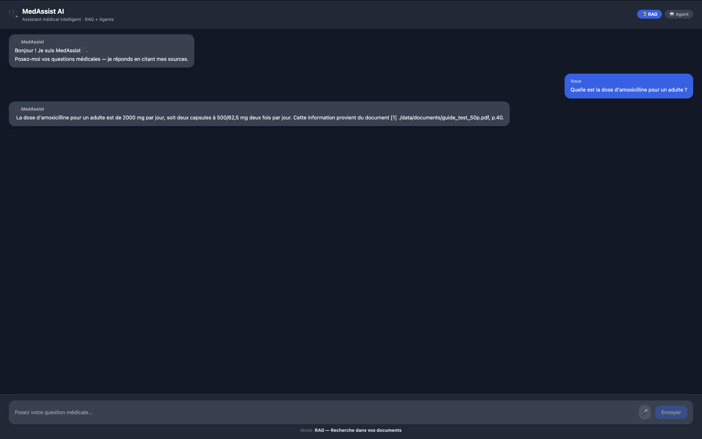

# MedAssist AI — Architecture & Rapport Technique

## 1. Présentation du projet

MedAssist AI est un assistant médical intelligent basé sur une architecture RAG (Retrieval-Augmented Generation). Il permet à des professionnels de santé d'interroger une base documentaire médicale en langage naturel, tout en obtenant des réponses sourcées avec références aux documents originaux.

Contrainte principale : toutes les données restent 100% locales — aucune information médicale ne transite par un serveur externe.

## 2. Stack technique

| Composant | Technologie |
|---|---|
| LLM génération | Mistral 7B via Ollama |
| Embeddings | nomic-embed-text via Ollama |
| Vector Store | FAISS |
| Orchestration RAG | LangChain 0.2 |
| Backend API | FastAPI + Uvicorn Python 3.11 |
| Frontend | React 18 + Vite + TailwindCSS |
| Conteneurisation | Docker + Docker Compose |
| Reverse Proxy | Nginx Alpine |

## 3. Pipeline RAG

### Indexation offline
PDF médical → PyPDFLoader → TextSplitter 500 tokens → nomic-embed-text → FAISS Index

### Inférence online
Question → Embedding → FAISS Retriever k=4 → Prompt enrichi → Mistral → SSE → UI

## 4. Structure du projet

backend/main.py — Point entrée FastAPI
backend/config.py — Settings pydantic
backend/routers/chat.py — POST /chat/ streaming SSE
backend/chains/rag_chain.py — Pipeline RAG LangChain
backend/vectorstore/indexer.py — Indexation PDF vers FAISS
backend/tools/medical_tools.py — Outils agent médical
frontend/src/App.jsx — Interface React
data/documents/ — PDF à indexer
docker-compose.yml — Orchestration Docker

## 5. Résultats obtenus

Question : Quelle est la dose d'amoxicilline pour un adulte ?

Réponse MedAssist :
La dose d'amoxicilline pour un adulte est de 2000 mg par jour, soit deux capsules à 500/62,5 mg deux fois par jour.
Source : guide_test_50p.pdf, page 40

- Citation source exacte avec numéro de page
- Streaming token par token
- 100% local, aucune donnée externe

## 6. Choix techniques justifiés

nomic-embed-text vs Mistral pour les embeddings : Mistral est un LLM de génération non optimisé pour les embeddings. nomic-embed-text est spécialisé, 10x plus rapide.

FAISS vs base vectorielle externe : FAISS fonctionne entièrement en mémoire locale, essentiel pour des données médicales confidentielles.

SSE vs WebSocket : Server-Sent Events suffisent pour le streaming unidirectionnel, plus simple et compatible nginx sans configuration spéciale.

## 7. Lancement

ollama pull mistral
ollama pull nomic-embed-text
cp .env.example .env
docker-compose up --build

Frontend : http://localhost:3000
API Docs : http://localhost:8000/docs

## 8. Améliorations possibles

- Authentification JWT
- Historique conversations SQLite
- Indexation guide MSF complet 678 pages
- Score de confiance RAG dans l'interface
- Déploiement Azure Container Apps
